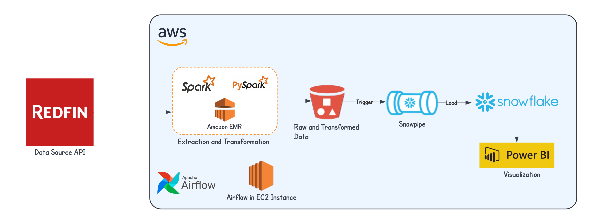

# Automated ETL Pipeline for Real Estate Analytics Using Airflow, AWS, Snowflake, and Power BI

## Overview

This repository contains the implementation of a ETL data pipeline for processing and visualizing real estate data from **Redfin's Data Source API**. The pipeline integrates Airflow, AWS services, Snowflake, and Power BI for efficient ETL (Extract, Transform, Load) and visualization.

### Architecture

The pipeline is structured as follows:

1. **Data Source**:
   - Data is sourced from the Redfin API and ingested into the pipeline.

2. **AWS EMR**:
   - **Spark** and **PySpark** are used for extraction, transformation, and processing of raw data.
   - The transformed data is written to S3 buckets.

3. **AWS S3**:
   - Stores raw and processed data.
   - S3 triggers Snowpipe for automated data loading into Snowflake.

4. **Snowflake**:
   - Acts as the central data warehouse.
   - Processes and stores cleaned data for downstream analytics.

5. **Power BI**:
   - Connects to Snowflake for data visualization and reporting.

6. **Apache Airflow**:
   - Deployed on an EC2 instance to orchestrate and schedule tasks in the pipeline.

---

## Features

- **Scalable Data Transformation**: Leverages AWS EMR to process large datasets.
- **Automated Data Ingestion**: Uses Snowpipe to load data into Snowflake seamlessly.
- **Comprehensive Reporting**: Power BI dashboards for real estate trends and analytics.
- **Workflow Automation**: Airflow manages and monitors ETL jobs.

---

## Prerequisites

- **AWS Account** with access to EMR, S3, EC2, and necessary IAM roles.
- **Snowflake** account for data warehousing.
- **Power BI** desktop or online for visualization.
- Python 3.x installed locally.

---
